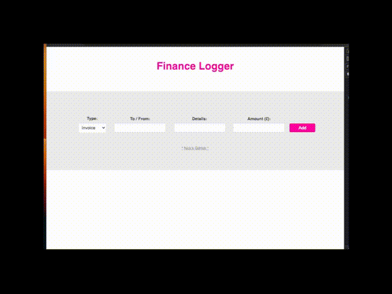

# Nick_Learns_TypeScript_Finance_Tracker
A finance tracker using TypeScript and simple javascript to capture input data and render it to the page.
Built using a few custom classes with constructors, formatters and an interface.

